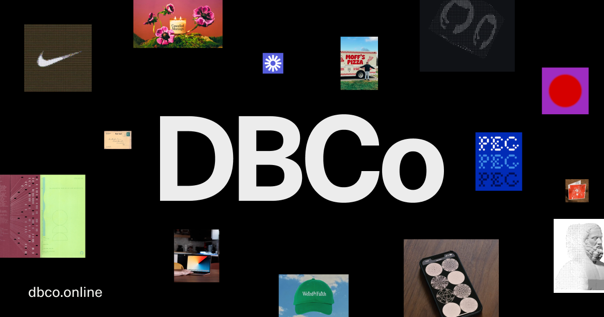

# dbco.online [](https://app.netlify.com/sites/dbco-frontend/deploys)



## Introduction

This is our little corner of the internet. In a shell, we us [Nuxt](https://nuxt.com/docs/getting-started/introduction) on the front-end, [Sanity](https://www.sanity.io/) as a backend, and [Netlify](https://www.netlify.com/) for hosting.

| Name             | Link                                                                                        |
| ---------------- | ------------------------------------------------------------------------------------------- |
| Production site  | [dbco.online/](https://dbco.online)                                                         |
| Sanity Studio    | [cms.dbco.online/](https://cms.dbco.online)                                                 |
| Netlify Instance | [app.netlify.com/sites/dbco-frontend](https://app.netlify.com/sites/dbco-frontend/overview) |

## Quick start

```bash
# clone repo
git clone https://github.com/egstad/nuxt.git

# install dependencies
npm install
```

## Scripts

```bash
# Run dev server (http://localhost:3000 by default):
npm run dev

# Build the application for production:
npm run build

# Locally preview production build:
npm run preview
```

## Store

There are a few Pinia stores we use — `app`, `device`, and `auth`.

- `app` contains info related to the app's current session.
- `device` contains device-specic info and user preferences.
- `auth` is used for password-protected pages.

All of these stores are accessed similarly, here's an example of how to fetch a devices `dpi` from the `device` store:

```html
<script setup>
  // import the store
  import { useDeviceStore } from "~/stores/device";

  // init the store
  const device = useDeviceStore();

  // get screen dpi from store
  const dpi = device.dpi;
</script>
```
